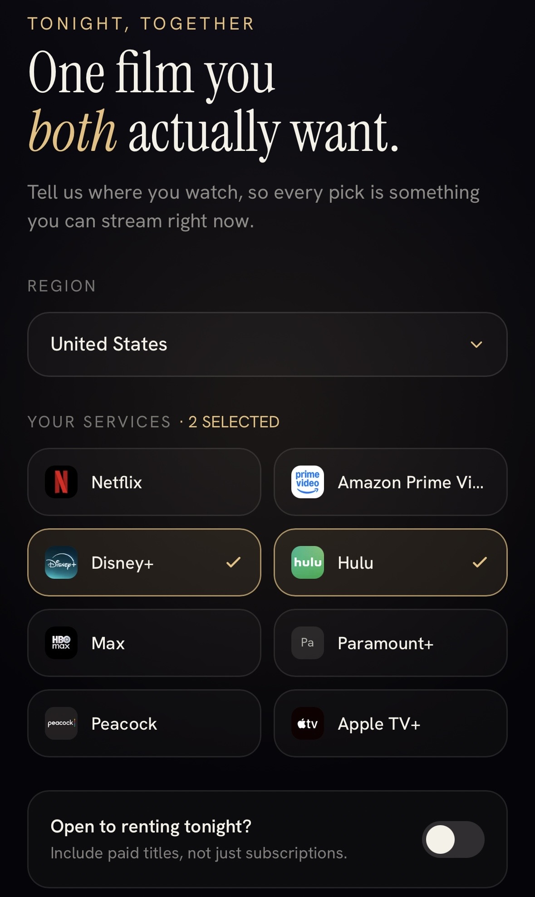
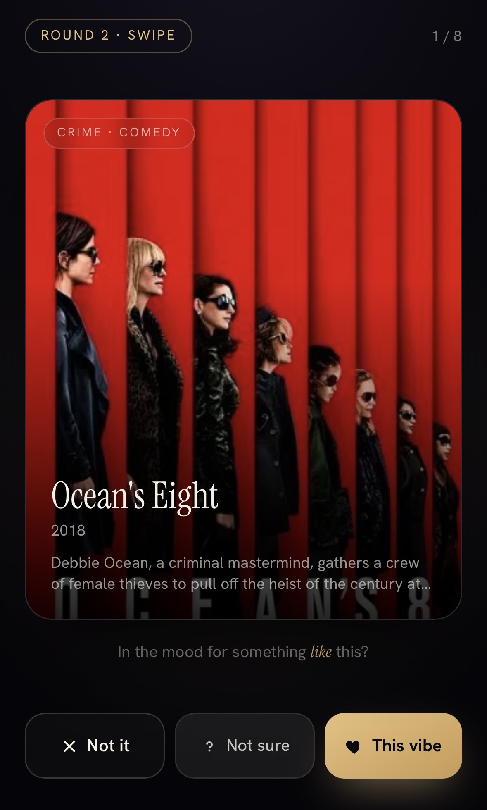
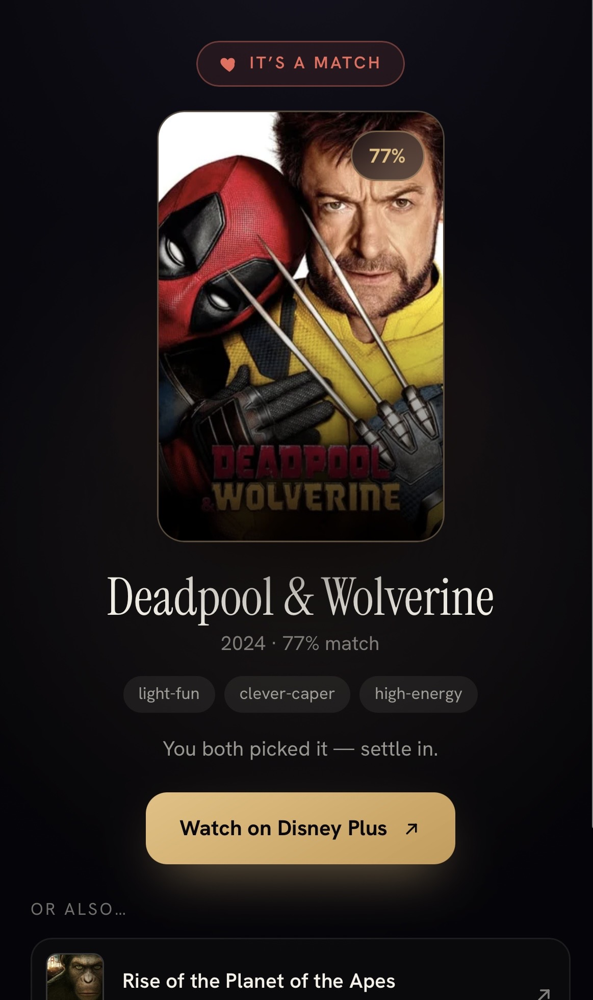
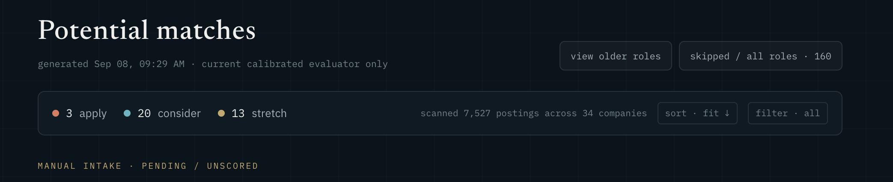
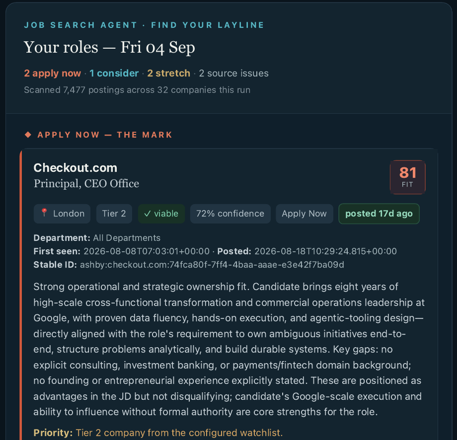

# Lasse

I build products that help people make decisions.

## Movie Match

**Bring the fun back to movie night.**

You sit down together to watch a film. Half an hour later, you're still switching apps, scrolling past recommendations, and asking, “What about this one?” Each service offers a different slice of the film catalog and a different idea of what you might like. Choosing becomes the evening.

Movie Match brings the search across streaming services into a playful game for two people sharing one phone. Recommendations start with **tonight's mood and the person beside you**. In a game designed to take under three minutes, you choose your moods, react to films, and discover a shortlist of up to five recommendations, with the services where you can watch them.

**Now in beta 1.9:** focused user testing is generating strong early feedback as the product moves towards launch.

[Try the beta](https://movie-match-rho.vercel.app) · [Explore the product and code](https://github.com/lasse-max/movie-match)

  
  
  

*Choose your services, react to films, and find a match. Screens supplied on 30 September 2026; titles and availability reflect the sessions shown.*

**Built with:** Next.js, React, TypeScript, Claude, TMDB, and Vercel.

## Sextant

**Find the right roles early. Put your time into landing them.**

Keeping up with new vacancies means checking company sites, repeating searches, and reading roles that only look relevant from their titles. That effort competes with the work that makes a candidate stronger: preparing for interviews, building skills, and writing thoughtful applications.

Sextant takes on the daily discovery work. In its current live setup, it scans a pool of **6,000+ roles every day** and delivers relevant opportunities to the inbox. Matching draws on a configurable company priority list, career background, skills, and practical constraints to explain why a role deserves attention.

The companion app turns those recommendations into action: clear fit bands help prioritise the list, evidence highlights strengths and gaps to address in an application, and a tracker keeps the next steps organised.

**Live and in active testing.** The next ambition is an open-source setup that lets other candidates configure and run a search around their own goals.

**Inside Sextant:** an app screenshot captured on 8 September 2026, plus an email excerpt from 4 September. Counts and recommendations are snapshots of the displayed runs. The operational app remains owner-only because it contains personal job-search data.

*From the scanned catalog to a prioritised set of opportunities.*

See the email digest

*The inbox digest brings together scan results, source-health signals and an explanation of role fit. This excerpt omits the email headers and personal eligibility details.*

**Built with:** Python, Claude, Next.js, TypeScript, Supabase Postgres, GitHub Actions, Resend, and Vercel.

## Training Coach

A personal workout tracker that uses logged sets to calculate the next session’s exercises, reps and load targets. Built for use on a phone, with offline session logging and progress tracking.

**In development.** The core tracker is implemented; deployment and reliability work are still in progress.

**Built with:** Python, FastAPI, JavaScript, Supabase Postgres, and Vercel.

## How I work

I define the product requirements, shape the user experience, and test the results. I use AI assistants for implementation and review.

## Contact

[Email](mailto:lassekrgr@gmail.com)
